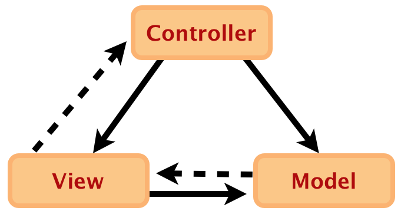

% Backbone.js on Rails
% thoughtbot; Jason Morrison; Chad Pytel; Nick Quaranto; Harold Giménez; Joshua Clayton; Gabe Berke-Williams; Chad Mazzola

\clearpage

# Introduction

## The shift to client-side web applications

Modern web applications have become increasingly rich, shifting their complexity onto
the client side.  While there are very well-understood approaches embodied in
mature frameworks to organize server-side code, frameworks for organizing your
client-side code are newer and generally still emerging.  Backbone is one such
library that provides a set of structures to help you organize your JavaScript
code.

Libraries like jQuery have done a great deal to help abstract inconsistencies
across browsers and provide a high-level API for making AJAX requests and
performing DOM manipulation, but larger and richer client-side applications that
lack decoupled and modular organizational structures often fall victim to the same 
few kinds of technical debt.

These apps are often highly asynchronous and the "path of least resistance"
implementation is often to have deeply nested callbacks to describe asynchronous
behavior, with nested Ajax calls and success/failure conditional concerns
going several layers deep.

Rich client-side applications almost always involve a layer of state and
logic on the client side.  One way to implement this is to store domain
objects or business logic state in the DOM.  However, storing state in the DOM,
stashing your application's data in hidden `<div>` elements
that you clone, graft, and toggle into and out of view, or reading and writing
to lengthy sets of HTML `data-*` attributes can quickly get cumbersome and confusing.

A third common feature in rich client-side apps is the presentation of multiple views on
a single domain object.  Consider a web conferencing application with multiple
views on the members of your contact list - each contact is rendered in brief
inside a list view, and in more specificity in a detail view.  Additionally,
your conference call history includes information about the people who
participated.  Each time an individual contact's information changes, this
information needs to cascade to all the view representations.

This often leads to a tight coupling of persistence and presentation: invoking
`$.ajax` to save a user's update and then updating several specific DOM elements
upon success.

By separating business logic, persistence, and presentation concerns, and
providing a decoupled, event-driven way to cascade changes through a system of
observers, each module of code is more well-encapsulated and expresses a
cohesive set of responsibilities without being coupled to outside concerns.
Your application code becomes easier to test, modify, and extend, and you
can better manage its complexity while its feature set grows.

Granted, you can thoughtfully organize your code in a clean, coherent manner
without using an external library.  However, using a library like Backbone helps you
get started more quickly, reduces the number of decisions to make, and provides
a common vocabulary for your team members or open source contributors.

If you're coming from a Rails background, you understand that a large part of Rails'
value is expressing and implementing highly-opinionated conventions that guide
development decisions.  Backbone doesn't do this.  Instead of trying to serve
as "the one way," or an opinionated framework like Rails, Backbone provides a
set of structures that help you organize your application by building your own
framework with its own set of conventions.

## Goals for this book

This book aims to cover topics that are of interest when integrating
Backbone into a Rails application.  The primary Backbone documentation is
quite good, and concisely readable.  While we'll touch on introductory
topics when they are critical to understand the points at hand, this book does
not aim to provide an introduction to Backbone, and generally assumes the reader can
lean on the Backbone documentation to explain the details of some concepts.

This book also does not aim to provide a comprehensive mapping of all possible
solutions to problem domains, but rather to describe the best approaches we
have found for solving problems and organizing applications using both Rails
and Backbone.

## Alternatives to Backbone

Web applications are pushing an increasing amount of responsibility to the client.
The user experience can be quite enjoyable, but deeply nesting callbacks and
relying on the DOM for app state are not.  Fortunately, there is a host of new JavaScript
client-side frameworks blossoming, and you have no shortage of options.

Knockout and Angular support declarative view-bindings and the Model-View-View
Model (MVVM) pattern.  Cappuccino and SproutCore deliver a rich library of UI
controls for building desktop-like applications.  JavaScriptMVC provides quite
a bit of structure, including dependency management and build tools.  Spine is
perhaps the most similar to Backbone, but takes an opinionated stance to
emphasize completely asynchronous client-server interactions for a faster user
experience.  Ember, originally a SproutCore rewrite, provides a host of
conventions including two-way bindings, computed properties, and auto-updating
templates.

Backbone favors a pared-down and flexible approach.  The code you write ends up
feeling very much like plain JavaScript.  Although you will need to write some
of your own conventions, Backbone is built to be easy to change: the source is
small, well annotated, and modularly designed.  It is small and flexible enough
to smoothly introduce into an existing application, but provides
enough convention and structure to help you organize your JavaScript.  Additionally, a
growing community of users brings with it a rich ecosystem of plugins, blog
articles, and support.

## The example application

The example application is a classic todo item manager.  This is a
popular example, and for good reason: The concepts and domain are familiar,
and room is left to explore interesting implementations like deferred
loading and file attachment.

While the example application is based on the content of the book, it
represents the _finished_ state of a lot of concepts discussed in the book. So,
while we show some concepts in the book and break them down, the example
application may then use a plugin that encapsulates that idea or is more
officially supported. The book is not meant to be a walk through of the
contents of `example_app`. Instead, `example_app` is intended to be a
standalone reference in and of itself, while being related to the book.

We did this intentionally so that the book can be a standalone reference rather
than being a sequential read that must be understood in sequence.

### Framework and library choice in the example application

The application uses Rails 3.2.6 and Ruby 1.9.2.  We provide an `.rvmrc`.

The included JavaScript libraries are non-minified for readability.  This
is a general good practice, and the Rails asset pipeline will properly package
the assets for production.

While Rails provides the ability to write in CoffeeScript, we have decided
to make all of the example code normal JavaScript so as to reduce the number
of new things introduced at once.

The example application comes with a full test suite.  The README in the
`example_app` root directory has instructions for bootstrapping the app and
running all the tests.

## Conventions used in this book

In code samples throughout the book, we include filenames where helpful to give
a sense of typical application structure.  These filenames do not always
correspond to a file in the example application.  When they are included in the
example application, sometimes the inline examples differ from the example
application to illustrate a particular point.

\clearpage

# Getting up to speed

## Backbone online resources

This book is not an introduction, and assumes you have some knowledge of
Javascript and of Backbone.  Fortunately, there is solid documentation available
to get you up to speed on Backbone.

The online documentation for Backbone is very readable:

<http://documentcloud.github.com/backbone/>

The GitHub wiki for Backbone links to a large number of tutorials and examples:

<https://github.com/documentcloud/backbone/wiki/Tutorials%2C-blog-posts-and-example-sites>

PeepCode is producing a three-part series on getting up to speed on Backbone:

<http://peepcode.com/products/backbone-js>

Finally, Nick Gauthier and Chris Strom have published an ebook with several real-world
examples they have extracted from production code:

<http://recipeswithbackbone.com/>

## JavaScript resources

_JavaScript: The Good Parts_ by Douglas Crockford is highly recommended for
any JavaScript developer.

_Test-Driven JavaScript Development_ by Christian Johansen teaches not only the
ins and outs of how to test-drive your code, but also covers good fundamental
JavaScript development practices and takes a deep dive on language
fundamentals.

Finally, _JavaScript Web Applications_ by Alex MacCaw provides broad and
thorough coverage on developing well-organized client side
applications.

\clearpage

# Organization

## Backbone and MVC

Model–View–Controller (MVC) is a software architectural pattern used in many
applications to isolate domain or business logic (the application logic for the user)
from the user interface (input and presentation).



In the above diagram, a solid line represents a direct association and a dashed
line represents an indirect association, such as one mediated by an observer.

As a user of Rails, you're likely already familiar with the concept of MVC and
the benefits that the separation of concerns can provide. However, Rails
itself is, technically, not traditional MVC, but a pattern called
[Model2](http://en.wikipedia.org/wiki/Model2). A traditional MVC is event-based,
and views are bound directly to models as observers, updating themselves when
the model changes.

Given that Javascript has events, and that much of the interactions between the
different components of Backbone in the browser are not limited to
request/response, Backbone can be structured as an actual MVC architecture.

That said, technically speaking, Backbone is _not_ MVC, and Backbone
acknowledged this when it renamed "Controllers" to "Routers" in version 0.5.0.

What is Backbone then, if not MVC?  Classically, views handled the presentation
of information, and controllers would take the user input and decide what
to do with it.  In Backbone, these two concerns are merged into view classes,
which are responsible for presentation as well as both establishing and responding
to UI event bindings.

## What goes where

Part of the initial learning curve of Backbone can be figuring out what goes
where, and mapping it to expectations set by working with Rails.  In Rails
we have Models, Views, Controllers, and Routers.  In Backbone, we have
Models, Collections, Views, Templates, and Routers.

It's important to note that, although Rails and Backbone share several concept
names, several of which have significant overlap, you shouldn't try to map your
understanding of one directly onto the other.  That said, it's valuable to draw
similarities to help ease the learning curve.

The models in Backbone and Rails are fairly analogous - each represent
objects in your domain, and both mix the concerns of domain logic with
persistence.  In Rails, the persistence is usually made to a database, and in 
Backbone.js it's generally made to a remote HTTP JSON API.

Backbone collections are just ordered sets of models.  Because it lacks
controllers, Backbone routers and views work together to pick up the
functionality provided by Rails controllers. Finally, in Rails, when we say
"views," we actually mean "templates," as Rails does not provide for view classes
out of the box.  In Backbone, however, you have a separation between the
view class and the HTML templates that they use.

Once you introduce Backbone into your application, you grow the layers in your
stack by four levels. This can be daunting at first, and frankly, at times it
can be difficult to keep straight everything that's going on in your application.
Ultimately, though, the additional organization and functionality of Backbone
outweighs the costs - let's break it down.

| Rails      |
|------------|
| Model      |
| Controller |
| View       |

| Backbone             |
|----------------------|
| Model and Collection |
| Router               |
| View                 |
| Template             |

In a typical Rails and Backbone application, the initial interaction between
the layers will be as follows:

- A request from a user comes in; the **Rails router** identifies what should
  handle the request, based on the URL
- The **Rails controller action** to handle the request is called; some initial
  processing may be performed
- The **Rails view template** is rendered and returned to the user's browser
- The **Rails view template** will include **Backbone initialization**; usually
  this is populating some *Backbone collections* as sets of **Backbone models**
  with JSON data provided by the **Rails view**
- The **Backbone router** determines which of its methods should handle the
  display, based on the URL
- The **Backbone router** calls that method; some initial processing
  may be performed, and one or more **Backbone views** are rendered
- The **Backbone view** reads **templates** and uses **Backbone** models to
  render itself onto the page

At this point, the user will see your application in their browser and be able to
interact with it.  The user interacting with elements on the page will trigger
actions to be taken at any level of the above sequence: **Backbone model**,
**Backbone views**, **Backbone routers**, or requests to the remote server.

Requests to the remote server may be any one of the following:

- Normal requests that don't hit Backbone and trigger a full page reload
- Normal Ajax requests, not using Backbone at all
- Ajax requests from the **Backbone model** or **Backbone collection**,
  communicating with Rails via JSON

Generally speaking, by introducing Backbone into our application we'll reduce
the first two types of requests, moving the bulk of client/server interaction
to requests encapsulated inside domain objects like Backbone models.

## Namespacing your application

You will want to create an object in JavaScript in which your Backbone
application will reside. This variable will serve as a namespace for your
Backbone application. Namespacing all of the JavaScript is desirable to
avoid potential collisions in naming. For example, it's possible that a
JavaScript library you want to use might also create a task variable. If you
haven't namespaced your task model, this would conflict.

This variable includes a place to hold models, collections, views, and routes,
and an `initialize` function which will be called to initialize the application.

Typically, initializing your application will involve creating a router and
starting Backbone history to route the initial URL fragment.  This app variable
will look like the following:

```javascript
// app/assets/javascripts/example_app.js
var ExampleApp = {
  Models: {},
  Collections: {},
  Views: {},
  Routers: {},
  initialize: function() {
    new ExampleApp.Routers.Tasks();
    Backbone.history.start();
  }
};
```

You can find a more fully fleshed-out version of this file in the example app
in `app/assets/javascripts/example_app.js`.

## Mixins

Backbone provides a basic mechanism for inheritance.  Sometimes, you'll want to
build a collection of related, reusable behavior and include that in several
classes that already inherit from a Backbone base class.  In these cases,
you'll want to use a [mixin](http://en.wikipedia.org/wiki/Mixin).

Backbone includes [Backbone.Events](http://documentcloud.github.com/backbone/#Events)
as an example of a mixin.

Here, we create a mixin named `Observer` that contains behavior for binding to
events in a fashion that can be cleaned up later:

```javascript
// app/assets/javascripts/observer.js
var Observer = {
  bindTo: function(source, event, callback) {
    source.on(event, callback, this);
    this.bindings = this.bindings || [];
    this.bindings.push({ source: source, event: event, callback: callback });
  },

  unbindFromAll: function() {
    _.each(this.bindings, function(binding) {
      binding.source.off(binding.event, binding.callback);
    });
    this.bindings = [];
  }
};
```

We can mix `Observer` into a class by using Underscore.js' `_.extend` on the
prototype of that class:

```javascript
// app/assets/javascripts/views/some_collection_view.js
SomeCollectionView = Backbone.View.extend({
  initialize: function() {
    this.bindTo(this.collection, "change", this.render);
  },

  leave: function() {
    this.unbindFromAll(); // calling a method defined in the mixin
    this.remove();
  }
});

_.extend(SomeCollectionView.prototype, Observer);
```

\clearpage

# Rails Integration

## Organizing your Backbone code in a Rails app

When using Backbone in a Rails app, you'll have two kinds of
Backbone-related assets: classes and templates.

## Rails 3.0 and prior

With Rails 3.0 and prior, store your Backbone classes in
`public/javascripts`:

```
public/
  javascripts/
    jquery.js
    jquery-ui.js
    collections/
      users.js
      todos.js
    models/
      user.js
      todo.js
    routers/
      users_router.js
      todos_router.js
    views/
      users/
        users_index.js
        users_new.js
        users_edit.js
      todos/
        todos_index.js
```

If you are using templates, we prefer storing them in `app/templates` to keep
them separated from the server views:

```
app/
  views/
    pages/
      home.html.erb
      terms.html.erb
      privacy.html.erb
      about.html.erb
  templates/
    users/
      index.jst
      new.jst
      edit.jst
    todos/
      index.jst
      show.jst
```

On Rails 3.0 and prior apps, we use Jammit for packaging assets and
precompiling templates:

<http://documentcloud.github.com/jammit/>

<http://documentcloud.github.com/jammit/#jst>

Jammit will make your templates available in a top-level JST object. For
example, to access the above todos/index.jst template, you would refer to it
as:

```javascript
JST['todos/index']
```

Variables can be passed to the templates by passing a Hash to the template, as
shown below.

```javascript
JST['todos/index']({ model: this.model })
```

### Jammit and a JST naming gotcha

One issue with Jammit that we've encountered and worked around is that the JST
template path can change when adding new templates.  Let's say you place
templates in `app/templates`. You work for a while on the "Tasks" feature,
placing templates under `app/templates/tasks`. So, `window.JST` looks something
like:

```javascript
window.JST == {
  "form":  "html for template...",
  "show":  "html for template...",
  "index": "html for template...",
};
```

Now, you add another directory under `app/templates`, say `app/templates/user`.
Now, templates with colliding names in JST references are prefixed with their
 parent directory name so they are unambiguous:

```javascript
window.JST == {
  "form":        "html...", // from tasks/form.jst.ejs
  "tasks/show":  "html...",
  "tasks/index": "html...",
  "new":         "html...", // from users/new.jst.ejs
  "users/show":  "html...",
  "users/index": "html...",
};
```

This breaks existing JST references. You can work around this issue by applying
the following monkeypatch to Jammit, in `config/initializers/jammit.rb`:

```ruby
Jammit::Compressor.class_eval do
  private
  def find_base_path(path)
    File.expand_path(Rails.root.join('app','templates'))
  end
end
```

As applications are moving to Rails 3.1 or above, they're also moving to
Sprockets for the asset packager.  Until then, many apps are using Jammit for
asset packaging.  We have an open issue and workaround:

<https://github.com/documentcloud/jammit/issues/192>

## Rails 3.1 and above

Rails 3.1 introduced the
[asset pipeline](http://guides.rubyonrails.org/asset_pipeline.html), which uses
the [Sprockets library](http://getsprockets.org) for preprocessing and packaging
assets.

To take advantage of the built-in asset pipeline, organize your Backbone
templates and classes in paths available to it: classes go in
`app/assets/javascripts/`, and templates go alongside, in
`app/assets/templates/`:

```
app/
  assets/
    javascripts/
      collections/
        todos.js
      models/
        todo.js
      routers/
        todos_router.js
      views/
        todos/
          todos_index.js
    templates/
      todos/
        index.jst.ejs
        show.jst.ejs
```

In Rails 3.1 and above, jQuery is provided by the `jquery-rails` gem, and no
longer needs to be included in your directory structure.

Using Sprockets' preprocessors, we can use templates as before. Here, we're
using the EJS template preprocessor to provide the same functionality as
Underscore.js' templates.  It compiles the `*.jst` files and makes them
available on the client side via the `window.JST` object. Identifying the
`.ejs` extension and invoking EJS to compile the templates is managed by
Sprockets, and requires the `ejs` gem to be included in the application Gemfile.

> Underscore.js templates:
> <http://documentcloud.github.com/underscore/#template>
>
> EJS gem:
> <https://github.com/sstephenson/ruby-ejs>
>
> Sprockets support for EJS:
> <https://github.com/sstephenson/sprockets/blob/master/lib/sprockets/ejs_template.rb>

To make the `*.jst` files available and create the `window.JST` object, require
them in your application.js Sprockets manifest:

```javascript
// app/assets/javascripts/application.js

// other application requires
//= require_tree ../templates
//= require_tree .
```

Load order for Backbone and your Backbone app is very
important. jQuery and Underscore must be loaded before Backbone. Then your models must be
loaded before your collections (because your collections will reference your
models) and then your routers and views must be loaded.

Fortunately, Sprockets can handle this load order for us. When all is said and
done, your application.js Sprockets manifest will look as shown below:

```ruby
# app/assets/javascripts/application.js
//= require jquery
//= require jquery_ujs
//= require jquery-ui-1.8.18.custom.min
//
//= require underscore
//= require json2
//= require backbone
//= require backbone-support
//
//= require backbone-forms.js
//= require jquery-ui-editors.js
//= require uploader.js
//
//= require vendor/visualsearch.js
//
//= require example_app
//
//= require_tree ./models
//= require_tree ./collections
//= require_tree ./views
//= require_tree ./routers
//= require_tree ../templates
//= require_tree .
```

The above is taken from the example application included with this book. You
can view it at `example_app/app/assets/javascripts/application.js`.

## An overview of the stack: connecting Rails and Backbone

By default, Backbone communicates with your Rails application via JSON HTTP
requests. If you've ever made a JSON API for your Rails app, then
for the most part, this will be very familiar.  If you have not made a JSON API
for your Rails application before, lucky you! It's pretty straightforward.

This section will briefly touch on each of the major parts of an application
using both Rails and Backbone.  We'll go into more detail in later chapters,
but this should give you the big picture of how the pieces fit together.

### Setting up models

In our example application, we have a Task model, exposed via a JSON API at
`/tasks`. The simplest Backbone representation of this model would be as
shown below:

```javascript
// app/assets/javascripts/models/task.js
var Task = Backbone.Model.extend({
  urlRoot: '/tasks'
});
```

The `urlRoot` property above describes a base for the server-side JSON API that
houses this resource.  Collection-level requests will occur at that root URL,
and requests relating to instances of this model will be found at `/tasks/:id`.

It's important to understand that there is no need to have a one-to-one mapping
between Rails models and Backbone models.  Backbone models instead correspond
with RESTful resources.  Since your Backbone code is in the presentation tier,
it's likely that some of your Backbone models may end up providing only a
subset of the information present in the Rails models, or they may aggregate
information from multiple Rails models into a composite resource.

In Rails, it's possible to access individual tasks, as well as all tasks (and
query all tasks) through the same `Task` model. In Backbone, models
only represent the singular representation of a `Task`. Backbone splits out the
plural representation of `Tasks` into `Collections`.

The simplest Backbone collection to represent our `Tasks` would be the
following.

```javascript
// app/assets/javascripts/collections/tasks.js
ExampleApp.Collections.Tasks = Backbone.Collection.extend({
  model: Task
});
```

If we specify the URL for `Tasks` in our collection instead, then models within
the collection will use the collection's URL to construct their own URLs, and
the `urlRoot` no longer needs to be specified in the model. If we make that
change, then our collection and model will be as follows.

```javascript
// app/assets/javascripts/collections/tasks.js
ExampleApp.Collections.Tasks = Backbone.Collection.extend({
  model: Task,
  url: '/tasks'
});

// app/assets/javascripts/models/task.js
var Task = Backbone.Model.extend({});
```

Notice in the above model definitions that there is no specification of the
attributes on the model. As in ActiveRecord, Backbone models get their
attributes from the data used to populate them at runtime. In this case,
this schema and data are JSON responses from the Rails server.

The default JSON representation of an ActiveRecord model is an object that includes
all the model's attributes. It does not include the data for any related models
or any methods on the model, but it does include the ids of any `belongs_to` relations
as those are stored in a `relation_name_id` attribute on the model.

The JSON representation of your ActiveRecord models will be retrieved by
calling `to_json` on them, which returns a string of JSON. Customize the output
of `to_json` by overriding the `as_json` method in your model, which returns a
Ruby data structure like a Hash or Array which will be serialized into the JSON
string.  We'll touch on this more later in the section, "Customizing your
Rails-generated JSON."

### Setting up Rails controllers

The Backbone models and collections will talk to your Rails controllers. The
most basic pattern is one Rails controller providing one family of RESTful
resource to one Backbone model.

By default, Backbone models communicate in the normal RESTful way that Rails
controllers understand, using the proper verbs to support the standard RESTful
Rails controller actions: index, show, create, update, and destroy. Backbone
does not make any use of the new action.

Therefore, it's just up to us to write a _normal_ RESTful controller.  The
newest and most succinct way to structure these is to use the `respond_with`
method, introduced in Rails 3.0.

When using `respond_with`, declare supported formats with `respond_to`. Inside
individual actions, you then specify the resource or resources to be delivered
using `respond_with`:

```ruby
# app/controllers/tasks_controller.rb
class TasksController < ApplicationController
  respond_to :html, :json

  def index
    respond_with(@tasks = Task.all)
  end
end
```

In the above example tasks controller, the `respond_to` line declares that this
controller should respond to requests for both the HTML and JSON formats. Then,
in the index action, the `respond_with` call will build a response according to
the requested content type (which may be HTML or JSON in this case) and
provided resource, `@tasks`.

#### Validations and your HTTP API

If a Backbone model has a `validate` method defined, it will be validated on
the client side, before its attributes are set. If validation fails, no changes
to the model will occur, and the "error" event will be fired. Your `validate`
method will be passed the attributes that are about to be updated. You can
signal that validation passed by returning nothing from your `validate` method.
You signify that validation has failed by returning something from the method.
What you return can be as simple as a string, or a more complex object that
describes the error in all its gory detail.

The amount of validation you include on the client side is essentially a
tradeoff between interface performance and code duplication.  It's important
for the server to make the last call on validation.

So, your Backbone applications will likely rely on at least some server-side
validation logic.  Invalid requests return non-2xx HTTP responses, which
are handled by error callbacks in Backbone:

```javascript
task.save({ title: "New Task title" }, {
  error: function() {
    // handle error from server
  }
});
```

The error callback will be triggered if your server returns a non-2xx
response. Therefore, you'll want your controller to return a non-2xx HTTP
response code if validations fail.

A controller that does this would appear as shown in the following example:

```ruby
# app/controllers/tasks_controller.rb
class TasksController < ApplicationController
  respond_to :json

  def create
    @task = Task.new(params[:task])
    if @task.save
      respond_with(@task)
    else
      respond_with(@task, :status => :unprocessable_entity)
    end
  end
end
```

The default Rails responders will respond with an unprocessable entity (422)
status code when there are validation errors, so the action above can be
refactored:

```ruby
# app/controllers/tasks_controller.rb
class TasksController < ApplicationController
  respond_to :json
  def create
    @task = Task.new(params[:task])
    @task.save
    respond_with @task
  end
end
```

Your error callback will receive both the model as it was attempted to be
saved and the response from the server. You can take that response and handle
the errors returned by the above controller in whatever way is fit for your
application.

A few different aspects of validations that we saw here are covered in other sections of this book. For more information about validations, see
the "Validations" section of the "Models and Collections" chapter. For more
information about reducing redundancy between client and server validations,
see the "Duplicating business logic across the client and server" section of
the "Models and Collections" chapter. For more information about handling and
displaying errors on the client side, see the "Forms" section of the
"Routers, Views and Templates" chapter.

### Setting Up Views

Most Backbone applications will be a single-page app, or "SPA." This means that
your Rails application handles two jobs: First, it renders a single page which
hosts your Backbone application and, optionally, an initial data set for it to
use. From there, ongoing interaction with your Rails application occurs via
HTTP JSON APIs.

For our example application, this host page will be located at `Tasks#index`,
which is also routed to the root route.

You will want to create an object in JavaScript for your Backbone application.
Generally, we use this object as a top-level namespace for other Backbone
classes, as well as a place to hold initialization code.  For more information
on this namespacing see the "Namespacing your application" section of the
Organization chapter.

This application object will look like the following:

```javascript
// app/assets/javascripts/example_app.js
var ExampleApp = {
  Models: {},
  Collections: {},
  Views: {},
  Routers: {},
  initialize: function(data) {
    this.tasks = new ExampleApp.Collections.Tasks(data.tasks);
    new ExampleApp.Routers.Tasks();
    Backbone.history.start();
  }
};
```

You can find this file in the example app in
`app/assets/javascripts/example_app.js`.

IMPORTANT: You must instantiate a Backbone router before calling
`Backbone.history.start()` otherwise `Backbone.history` will be `undefined`.

Then, inside `app/views/tasks/index.html.erb` you will call the `initialize` method.
You will often bootstrap data into the Backbone application to provide initial
state.  In our example, the tasks have already been provided to the Rails view
in an `@tasks` instance variable:

```javascript
<!-- app/views/tasks/index.html.erb -->
<%= content_for :javascript do -%>
  <%= javascript_tag do %>
    ExampleApp.initialize({ tasks: <%== @tasks.to_json %> });
  <% end %>
<% end -%>
```

The above example uses ERB to pass the JSON for the tasks to the `initialize`
method, but we should be mindful of the XSS risks that dumping user-generated
content here poses.  See the "Encoding data when bootstrapping JSON data"
section in the "Security" chapter for a more secure approach.

Finally, you must have a Router in place that knows what to do.  We'll cover
routers in more detail in the "Routers, Views and Templates" chapter.

```javascript
// app/assets/javascripts/routers/tasks.js
ExampleApp.Routers.Tasks = Backbone.Router.extend({
  routes: {
    "": "index"
  },

  index: function() {
    // We've reached the end of Rails integration - it's all Backbone from here!

    alert('Hello, world!  This is a Backbone router action.');

    // Normally you would continue down the stack, instantiating a
    // Backbone.View class, calling render() on it, and inserting its element
    // into the DOM.

    // We'll pick back up here in the "Converting Views" section.
  }
});
```

The example router above is the last piece needed to complete our
initial Backbone infrastructure. When a user visits `/tasks`, the
`index.html.erb` Rails view will be rendered, which properly initializes
Backbone and its dependencies and the Backbone models, collections, routers,
and views.

## Customizing your Rails-generated JSON

There are a few common things you'll do in your Rails app when working with
Backbone.

First, it's likely that you'll want to switch from including all attributes,
which is the default, to delivering some subset.

This can be done by specifying explicitly only the attributes that are to be
included (whitelisting), or specifying the attributes that should _not_ be
included (blacklisting). Which one you choose will depend on how many attributes
your model has and how paranoid you are about something important appearing in
the JSON when it shouldn't be there.

If you're concerned about sensitive data unintentionally being included in the
JSON when it shouldn't be, then you'll want to whitelist attributes into the
JSON with the `:only` option:

```ruby
# app/models/some_model.rb
def as_json(options = {})
  super(options.merge(:only => [ :id, :title ]))
end
```

The above `as_json` override will make it so that the JSON will _only_ include the
id and title attributes, even if there are many other attributes on the model.

If instead you want to include all attributes by default and just exclude a few,
you accomplish this with the `:except` option:

```ruby
# app/models/some_model.rb
def as_json(options = {})
  super(options.merge(:except => [ :encrypted_password ]))
end
```

Another common customization you will want to do in the JSON is include the
output of methods (say, calculated values) on your model. This is accomplished
with the `:methods` option, as shown in the following example:

```ruby
# app/models/some_model.rb
def as_json(options = {})
  super(options.merge(:methods => [ :calculated_value ]))
end
```

The final thing you'll most commonly do with your JSON is include related
objects. If the `Task` model `has_many :comments`, include all of the JSON for
comments in the JSON for a Task with the `:include` option:

```ruby
# app/models/some_model.rb
def as_json(options = {})
  super(options.merge(:include => [ :comments ]))
end
```

As you may have guessed, you can then customize the JSON for the comments by
overriding the `as_json` method on the `Comment` model.

While this is the most common set of `as_json` options you'll use when working with
Backbone, it certainly isn't all of them. The official, complete
documentation for the `as_json` method can be found here:
<http://apidock.com/rails/ActiveModel/Serializers/JSON/as_json>

### ActiveRecord::Base.include_root_in_json

Depending on the versions, Backbone and Rails may have different expectations
about the format of JSON structures; specifically, whether or not a root key is
present.  When generating JSON from Rails, this is controlled by the
ActiveRecord setting `ActiveRecord::Base.include_root_in_json`.

```ruby
  > ActiveRecord::Base.include_root_in_json = false
  > Task.last.as_json
 => {"id"=>4, "title"=>"Enjoy a three mile swim"}

  > ActiveRecord::Base.include_root_in_json = true
  > Task.last.as_json
 => {"task"=>{"id"=>4, "title"=>"Enjoy a three mile swim"}}
```

In Rails 3.0, `ActiveRecord::Base.include_root_in_json` is set to "true."
Starting with 3.1, it defaults to "false." This reversal was made to simplify
the JSON returned by default in Rails application, but it is a fairly big
change from the default behavior of Rails 3.0.

Practically speaking, this change is a good one, but take particular note if
you're upgrading an existing Rails 3.0 application to Rails 3.1 or above and
you already have a published API; you may need to expose a new version of your
API.

From the Backbone side, the default behavior expects no root node.  This
behavior is defined in a few places: `Backbone.Collection.prototype.parse`,
`Backbone.Model.prototype.parse`, and `Backbone.Model.prototype.toJSON`:

```javascript
// backbone.js

_.extend(Backbone.Collection.prototype, Backbone.Events, {
  // http://documentcloud.github.com/backbone/#Collection-parse
  parse : function(resp, xhr) {
    return resp;
  },

  // snip...
});

_.extend(Backbone.Model.prototype, Backbone.Events, {
  // http://documentcloud.github.com/backbone/#Model-toJSON
  toJSON : function() {
    return _.clone(this.attributes);
  },

  // http://documentcloud.github.com/backbone/#Model-parse
  parse : function(resp, xhr) {
    return resp;
  },

  // snip...
});
```

If you need to accept JSON with a root node, you can override `parse` in each of
your models, or override the prototype's function.  You'll need to override it
on the appropriate collection(s), too.

If you need to send JSON back to a server that includes a root node, you can
override `toJSON`, per model or across all models.  When you do this, you'll
need to explicitly specify the name of the root key.  We use a convention of a
`modelName` function on your model to provide this:

```javascript
// app/assets/javascripts/backbone_overrides.js
Backbone.Model.prototype.toJSON = function() {
  var hashWithRoot = {};
  hashWithRoot[this.modelName] = this.attributes;
  return _.clone(hashWithRoot);
};

// app/assets/javascripts/models/task.js
var Task = Backbone.Model.extend({
  modelName: "task",

  // ...
});
```

## Converting an existing page/view area to use Backbone

This section is meant to get you started understanding how Backbone views
work by illustrating the conversion of a Rails view to a Backbone view.

Its important to note that a Rails view is not directly analogous to a Backbone
view. In Rails, the term "view" usually refers to an HTML template, where
Backbone views are classes that contain event handling and presentation logic.

Consider the following Rails view for a tasks index:

```rhtml
<!-- app/views/tasks/index.html.erb -->
<h1>Tasks</h1>

<table>
  <tr>
    <th>Title</th>
    <th>Completed</th>
  </tr>

  <% @tasks.each do |task| %>
    <tr>
      <td><%= task.title %></td>
      <td><%= task.completed %></td>
    </tr>
  <% end %>
</table>
```

So far, we have the Backbone `Task` model and collection and the Rails `Task`
model and controller discussed above, and we're bootstrapping the Backbone app
with all the tasks.  Next, we will create a Backbone view which will render a
corresponding Backbone template.

A Backbone view is a class that is responsible for rendering the display of a
logical element on the page. A view also binds to DOM events occurring within
its DOM scope that trigger various behaviors.

We'll start with a basic view that achieves the same result as the Rails template
above, rendering a collection of tasks:

```javascript
// app/assets/javascripts/views/tasks_index.js
ExampleApp.Views.TasksIndex = Backbone.View.extend({
  render: function () {
    this.$el.html(JST['tasks/index']({ tasks: this.collection }));
    return this;
  }
});
```

The `render` method above renders the `tasks/index` JST template, passing
the collection of tasks into the template.

Each Backbone view has an element that it stores in `this.$el`.  This element
can be populated with content, although it's a good practice for code outside
the view to actually insert the view into the DOM.

We'll update the Backbone route to instantiate this view, passing in the
collection for it to render. The router then renders the view, and inserts it
into the DOM:

```javascript
// app/assets/javascripts/routers/tasks.js
ExampleApp.Routers.Tasks = Backbone.Router.extend({
  routes: {
    "": "index"
  },

  index: function() {
    var view = new ExampleApp.Views.TasksIndex({ collection: ExampleApp.tasks });
    $('body').html(view.render().$el);
  }
});
```

Now that we have the Backbone view in place that renders the template, and
it's being called by the router, we can focus on converting the above Rails
view to a Backbone template.

Backbone depends on Underscore.js which, among many things, provides
templating.  The delimiter and basic concepts used for Underscore.js
templates and ERB are the same.  When converting an existing Rails application
to Backbone, this similarity can help ease the transition.

The `tasks/index` JST template does two things:

* Loops over all of the tasks
* For each task, it outputs the task title and completed attributes

Underscore.js provides many iteration functions that will be familiar to Rails
developers such as  `_.each`, `_.map`, and `_.reject`. Backbone also proxies to
Underscore.js to provide these iteration functions as methods on `Backbone.Collection`.

We'll use the `each` method to iterate through the `Tasks` collection that was
passed to the view, as shown in the converted Underscore.js template below:

```rhtml
<!-- app/assets/templates/tasks/index.jst.ejs -->
<h1>Tasks</h1>

<table>
  <tr>
    <th>Title</th>
    <th>Completed</th>
  </tr>

  <% tasks.each(function(model) { %>
    <tr>
      <td><%= model.escape('title') %></td>
      <td><%= model.escape('completed') %></td>
    </tr>
  <% }); %>
</table>
```

In Rails 3.0 and above, template output is HTML-escaped by default. In order to
ensure that we have the same XSS protection as we did in our Rails template, we
access and output the Backbone model attributes using the `escape` method
instead of the normal `get` method.

### Breaking out the TaskView

In Backbone, views are often bound to an underlying model, re-rendering
themselves when the model data changes.  Consider what happens when any task
changes data with our approach above; the entire collection must be
re-rendered.  It's useful to break up these composite views into two separate
classes, each with their own responsibility: a parent view that handles the
aggregation, and a child view responsible for rendering each node of content.

With each of the `Task` models represented by an individual `TaskView`,
changes to an individual model are broadcast to its corresponding `TaskView`,
which re-renders only the markup for one task.

Continuing our example from above, a `TaskView` will be responsible for
rendering just the individual table row for a `Task`:

```rhtml
<!-- app/assets/templates/tasks/task.jst.ejs -->
<tr>
  <td><%= model.escape('title') %></td>
  <td><%= model.escape('completed') %></td>
</tr>
```

And the Task index template will be changed to appear as shown below:

```rhtml
<!-- app/assets/templates/tasks/index.jst.ejs -->
<h1>Tasks</h1>

<table>
  <tr>
    <th>Title</th>
    <th>Completed</th>
  </tr>

  <!-- child content will be rendered here -->

</table>
```

As you can see above in the index template, the individual tasks are no longer
iterated over and rendered inside the table, but instead within the
`TasksIndex` and `TaskView` views, respectively:

```javascript
// app/assets/javascripts/views/task.js
ExampleApp.Views.TaskView = Backbone.View.extend({
  render: function () {
    this.$el.html(JST['tasks/view']({ model: this.model }));
    return this;
  }
});
```

The `TaskView` view above is very similar to the one we saw previously for the
`TasksIndex` view.  It is only responsible for rendering the contents of its own
element, and the concern of assembling the view of the list is left to the
parent view object:

```javascript
// app/assets/javascripts/views/tasks_index.js
ExampleApp.Views.TasksIndex = Backbone.View.extend({
  render: function () {
    var self = this;

    this.$el.html(JST['tasks/index']()); // Note that no collection is needed
                                         // to build the container markup.

    this.collection.each(function(task) {
      var taskView = new ExampleApp.Views.TaskView({ model: task });
      self.$('table').append(taskView.render().el);
    });

    return this;
  }
});
```

In the new `TasksIndex` view above, the `tasks` collection is iterated over. For
each task, a new `TaskView` is instantiated, rendered, and then inserted into
the `<table>` element.

If you look at the output of the `TasksIndex`, it will appear as follows:

```rhtml
<!-- output HTML -->
<div>
  <h1>Tasks</h1>

  <table>
    <tr>
      <th>Title</th>
      <th>Completed</th>
    </tr>

    <div>
      <tr>
        <td>Task 1</td>
        <td>true</td>
      </tr>
    </div>
    <div>
      <tr>
        <td>Task 2</td>
        <td>false</td>
      </tr>
    </div>
  </table>
</div>
```

Unfortunately, we can see that there is a problem with the above rendered
view: the surrounding div around each of the rendered tasks.

Each of the rendered tasks has a surrounding div because this is the element
that each view has that is accessed via `this.el`, and what the view's content
is inserted into. By default, this element is a div and therefore every view
will be wrapped in an extra div. While sometimes this extra div doesn't really
matter, as in the outermost div that wraps the entire index, other times this
produces invalid markup.

Fortunately, Backbone provides us with a clean and simple mechanism for
changing the element to something other than a div. In the case of the
`TaskView`, we would like this element to be a tr, then the wrapping tr can be
removed from the task view template.

The element to use is specified by the `tagName` member of the `TaskView`, as
shown below:

```javascript
// app/assets/javascripts/views/task_view.js
ExampleApp.Views.TaskView = Backbone.View.extend({
  tagName: "tr",

  initialize: function() {
  },

  render: function () {
    this.$el.html(JST['tasks/view']({ model: this.model }));
    return this;
  }
});
```

Given the above `tagName` customization, the task view template will appear as
follows:

```rhtml
// app/assets/templates/tasks/view.jst.ejs
<td><%= model.escape('title') %></td>
<td><%= model.escape('completed') %></td>
```

And the resulting output of the `TasksIndex` will be much cleaner, as shown
below:

```html
<!-- output HTML -->
<div>
  <h1>Tasks</h1>

  <table>
    <tr>
      <th>Title</th>
      <th>Completed</th>
    </tr>

    <tr>
      <td>Task 1</td>
      <td>true</td>
    </tr>
    <tr>
      <td>Task 2</td>
      <td>false</td>
    </tr>
  </table>
</div>
```

We've now covered the basic building blocks of converting Rails views to
Backbone and getting a functional system. The majority of Backbone programming
you will do will likely be in the views and templates, and there is a lot more
to them: event binding, different templating strategies, helpers, event
unbinding, and more. Those topics are covered in the "Routers, Views, and
Templates" chapter.

## Using Rails URL helpers from Backbone

Often times you will have part of your application written in Rails, and part
in Backbone.  Maybe you are converting an existing Rails app to Backbone
piecewise, or maybe there are portions of your app that just make more sense as
normal HTTP page requests.  Either way, you may eventually find that you want
to link to a Rails URL from a Backbone view or template.

Let's imagine that you are converting the tasks application from a typical
Rails app into the Backbone app we are working on.  Say there is a page
that displays the history for a task, and it is not yet converted to Backbone,
but you want to link to it from the Backbone templates.

Let's say that the task history is visible at a URL of `/tasks/:id/history`.
We will add this link as a fourth column in the template:

```rhtml
<!-- app/assets/templates/tasks/item.jst.ejs -->
<td><label>Task title</label><a class="task-link" href="#">details</a></td>
<td class="assignees">(Unassigned)</td>
<td><input type="checkbox"></td>
<td class="history">
  <a href="#">Task History</a>
</td>
```

and populate it from the view:

```javascript
// app/assets/javascripts/views/task_item.js

ExampleApp.Views.TaskItem = Support.CompositeView.extend({
  // ...
  renderFormContents: function() {
    // Existing code
    this.$('label').attr("for", "task_completed_" + this.model.get('id'));
    this.$('label').html(this.model.escape('title'));
    this.$('input').attr("id", "task_completed_" + this.model.get('id'));
    this.$('input').prop("checked", this.model.isComplete());
    this.$('td.assignees').html(this.model.assignedUsers.pluck('email').join(", "));
    this.$('a').attr("href", this.taskUrl());

    // New code
    this.$('td.history a').attr("href", "/tasks/" + this.model.get('id') + "/history");
  },
  // ...
});
```

Now, the way we have constructed the URL in `renderFormContents` works, but it
is fragile; it would break quietly if we changed the Rails routing structure.
While an integration test would catch such a regression, this way of linking
also unnecessarily duplicates the knowledge of how the URL is constructed.

A library named [JsRoutes](https://github.com/railsware/js-routes/) will automatically
build JavaScript functions that correspond to the Rails path helper functions
available for your Rails routes.

Install the `js-routes` gem into your application, include the `js-routes`
JavaScript via the asset pipeline, and you will have a global `Routes` object
available in JavaScript that provides JavaScript functions similar to the Rails
path helper methods.  Let's replace our manual URL construction with one of
these helpers:

```javascript
// app/assets/javascripts/views/task_item.js
renderFormContents: function() {
  // ...(existing code)...

  // Old history link:
  // this.$('td.history a').attr("href", "/tasks/" + this.model.get('id') + "/history");

  // New history link:
  this.$('td.history a').attr("href", Routes.task_history_path(this.model));
}
```

Since the `Routes` object is global, you can invoke these route helpers directly from
templates as well:

```rhtml
<!-- app/assets/templates/tasks/item.jst.ejs -->
<td><label>Task title</label><a class="task-link" href="#">details</a></td>
<td class="assignees">(Unassigned)</td>
<td><input type="checkbox"></td>
<td class="history">
  <a href="<%= Routes.task_history_path(this.task) %>">Task History</a>
</td>
```

If you are using a templating library like
[Handlebars.js](http://handlebarsjs.com/) that supports helper functions, you
could include the Routes object's helper functions into your view context
directly to eliminate the need to prefix the calls with `Routes.`:

```javascript
// somewhere at initialization time, assuming you are using Handlebars.js:
_.each(Routes, function(helper, name) {
  Handlebars.registerHelper(name, helper);
});
```

\clearpage

# Routers, Views, and Templates

## View explanation

A Backbone view is a class that is responsible for rendering the display of
a logical element on the page. A view can also bind to events which may cause
it to be re-rendered.

Again, it's important to note that a Rails view is not directly analogous to a
Backbone view. A Rails view is more like a Backbone _template_, and
Backbone views are often more like Rails _controllers_, in that they are
responsible for deciding what should be rendered and how, and for rendering the
actual template file. This can cause confusion with developers just starting
with Backbone.

A basic Backbone view appears as follows.

```javascript
// app/assets/javascripts/views/example_view.js
ExampleApp.Views.ExampleView = Backbone.View.extend({
  tagName: "li",
  className: "example",
  id: "example_view",

  events: {
    "click a.save": "save"
  },

  render: function() {
    this.$el.html(JST['example/view']({ model: this.model }));
    return this;
  },

  save: function() {
    // do something
  }
};
```

### Initialization

Backbone views could also include an `initialize` function which will
be called when the view is instantiated.

You only need to specify the initialize function if you wish to do something
custom. For example, some views call the `render()` function upon
instantiation. It's not necessary to immediately render that way,
but it's relatively common to do so.

You create a new view by instantiating it with `new`. For example, `new
ExampleView()`. It is possible to pass in a hash of options with `new
ExampleView(options)`. Any options you pass into the constructor will be
available as `this.options` from inside of the view.

There are a few special options that, when passed, will be assigned as
properties of view. These are `model`, `collection`, `el`, `id`,
`className`, and `tagName`. For example, if you create a new view and give it
a model option using `new ExampleView({ model: someTask })`, then
`someTask` will be available as `this.model` from inside of the view.

### The View's element

Each Backbone view has an element which it stores in `this.el`. This element
can be populated with content, but isn't on the page until placed there by
you. Using this strategy it is then possible to render views outside of the
current DOM at any time, and then later, in your code, insert the new elements all
at once. In this way, high performance rendering of views can be achieved with as
few reflows and repaints as possible.

A jQuery or Zepto object of the view's element is available in `this.$el`.
This is useful, in that you don't need to repeatedly call `$(this.el)`. This jQuery
or Zepto call is also cached, so it should be a performance improvement over
repeatedly calling `$(this.el)`.

It is possible to create a view that references an element already in the DOM,
instead of a new element. To do this, pass in the existing element as an
option to the view constructor with `new ExampleView({ el: existingElement })`.

You can also set this after the fact with the `setElement()` function:

```javascript
var view = new ExampleView();
view.setElement(existingElement);
```

### Customizing the View's Element

You can use `tagName`, `className`, and `id` to customize the new element
created for the view. If no customization is done, the element is an empty
`div`.

`tagName`, `className`, and `id` can either be specified directly on the view
or passed in as options at instantiation. Since `id` will usually correspond
to the `id` of each model, it will likely be passed in as an option rather
than declared statically in the view.

`tagName` will change the element that is created from a `div` to something
else that you specify. For example, setting `tagName: "li"` will result in the
view's element being an `li` rather than a `div`.

`className` will add an additional class to the element that is created for
the view. For example, setting `className: "example"` in the view will result
in that view's element having that additional class like `<div class="example">`.

### Rendering

The `render` function above renders the `example/view` template. Template
rendering is covered in depth in the "Templating strategy" chapter. Suffice to
say, nearly every view's render function will render some form of template. Once
that template is rendered, other actions to modify the view may be taken.

In addition to rendering a template, typical responsibilities of the `render` function
could include adding more classes or attributes to `this.el`, or firing or
binding other events.

Backbone, when used with jQuery (or Zepto) provides a convenience function
of `this.$` that can be used for selecting elements inside of the view.
`this.$(selector)` is equivalent to the jQuery function call `$(selector,
this.el)`

A nice convention of the render function is to return `this` at the end of
render to enable chained calls on the view - usually fetching the element.
For example:

```javascript
// app/assets/javascripts/views/some_view.js
render: function() {
  this.$el.html(this.childView.render().el);
  return this;
}
```

### Events

The view's `events` hash specifies a mapping of the events and elements that
should have events bound, and the functions that should be bound to those
events. In the example above, the `click` event is being bound to the
element(s) that match the selector `a.save` within the view's element. When
that event fires, the `save` function will be called on the view.

When event bindings are declared with the `events` hash, the DOM events are bound
with the `$.delegate()` function. Backbone also takes care of binding the
event handlers' `this` to the view instance using `_.on()`.

Event binding is covered in great detail in the "Event binding" chapter.

## Templating strategy

There's no shortage of templating options for JavaScript. They generally fall into three categories:

* *HTML with JavaScript expressions interpolated.* Examples: `_.template`, EJS
* *HTML with other expressions interpolated, often logic-free.* Examples: Mustache, Handlebars, `jQuery.tmpl`
* *Selector-based content declarations.* Examples: PURE, just using jQuery from view classes

To quickly compare the different approaches, we will work with creating a
template that renders the following HTML:

```html
<ul class="tasks">s
  <li><span class="title">Buy milk</span> Get the good kind </li>
  <li><span class="title">Buy cheese</span> Sharp cheddar </li>
  <li><span class="title">Eat cheeseburger</span> Make with above cheese </li>
</ul>
```

Assuming we have a TasksCollection instance containing the three elements
displayed in the above HTML snippet, let's look at how different templating
libraries accomplish the same goal of rendering the above. Since you're already familiar with Underscore.js templates, let's start there.

An Underscore.js template may look like this:

```rhtml
<ul class="tasks">
  <% tasks.each(function(task) { %>
    <li>
        <span class="title"> <%= task.escape("title") %> </span>
        <%= task.escape("body") %>
    </li>
  <% }) %>
</ul>
```

Here, we interpolate a bit of JavaScript logic in order to iterate
through the collection and render the desired markup. Also note
that we must fetch escaped values from the task objects, as Underscore.js
templates do not perform any escaping on their own.

This is probably the path of least resistance on a Rails Backbone app.
Since Backbone depends on Underscore.js, it is already available in
your app. As has already been shown in earlier chapters, its usage
is very similar to ERB. It has the same `<%=` and `%>` syntax as ERB,
and you can pass it an options object that is made available to the
template when it's rendered.

While we've found Underscore.js' templating to be useful and sufficient to
build large backbone applications, there are other templating libraries
that are worth mentioning here because they either provide richer
functionality or take a different approach to templating.

Handlebars is one such example. One major distinction of Handlebars is
that it allows you to define and register helpers that can be used when
rendering a template, providing a framework for writing helpers similar
to those found in ActionView::Helpers, like `domID` or other generic
rendering logic. It also allows you to write what are called "block helpers,"
which are functions that are executed on a different, supplied context during
rendering. Handlebars itself exploits this functionality by providing
a few helpers out of the box. These helpers are `with`, `each`, `if`
and `unless`, and simply provide control structures for rendering logic.

The above template would look like this in Handlebars:

```rhtml
<ul class="title">
  {{#each tasks}}
    <li>
        <span class="title"> {{ this.get("title") }} </span>
        {{ this.get("body") }} %>
    </li>
  {{/each}}
<ul>
```

Of note:

* Use of `{{#each}}`, which iterates over the collection
* Within the `{{#each}}` block, the JavaScript context is
  the task itself, so you access its properties via `this`
* There's no need to escape HTML output, as Handlebars escapes
  by default

A similar library is Mustache.js. Mustache is a templating system
that has been ported to a number of languages including JavaScript. The
promise of Mustache is "logic-less templates." Instead of requiring you to write
logic in pure JavaScript, using `if`, for example, Mustache provides a set of tags
that take on different meanings. They can render values or not render anything at
all.

Like Handlebars, Mustache HTML escapes rendered values by default.

You can learn more about Handlebars at the [project's home on the web](http://www.handlebarsjs.com/),
and Mustache at [the project's man page](http://mustache.github.com/mustache.5.html)
and [javascript implementation](https://github.com/janl/mustache.js)

## Choosing a strategy

Like any technology choice, there are trade-offs to evaluate and external factors
to consider when choosing a templating approach.

One of the common questions we've found ourselves asking is: Do I
already have server-side templates written that I'd like to "Backbone-ify," or
am I writing new Backbone functionality from scratch? Both of these scenarios
are described in more detail in the next two sections.

### Adding Backbone to existing Rails views

If you are replacing existing Rails app pages with Backbone, you are already
using a templating engine, and it's likely ERB. When making the switch to
Backbone, change as few things as possible at a time, and stick with your
existing templating approach.

If you're using ERB, give `_.template` a shot. It defaults to the same
delimiters as ERB for interpolation and evaluation, `<%= %>` and `<% %>`,
which can be a boon or can be confusing. If you'd like to change them,
you can update `.templateSettings` - check the Underscore.js docs.

If you're using Haml, check out the `jquery-haml` and `haml-js` projects.

If you're using Mustache.rb or Handlebars.rb, you're likely aware that
JavaScript implementations of these both exist, and that your existing
templates can be moved over much like the ERB case.

Ultimately, you should choose a templating strategy that your entire team is
comfortable with, while minimizing the cost of rewriting templates.  Make sure
that designers' considerations are taken into account, because it will affect how
they work with that area of the app as well.

### Writing new Backbone functionality from scratch

If you're not migrating from existing server-side view templates,
you have more freedom of choice. Strongly consider the option of no templating
at all, but rather using plain HTML templates, and then decorating the DOM from
your view class.

You can build static HTML mockups of the application first, and pull these
mockups directly in as templates, without modifying them.

```html
<!-- app/views/some/page.html.erb -->
<div id="song-player">
  <nav>
    <a class="home"    href="#/">Home</a>
    <a class="profile" href="/profile.html">My Profile</a>
  </nav>
  <h2>Song title</h2>

  <audio controls="controls">
    <source src="/test.ogg" type="audio/ogg" />
    Your browser does not support the audio element.
  </audio>
</div>
<!-- snip -->
```

```javascript
// app/assets/javascripts/views/my_view.js
MyView = Backbone.View.extend({
  render: function() {
    this.renderTemplate();
    this.fillTemplate();
  },

  renderTemplate: function() {
    this.$el.html(JST['songs/index']());
  },

  fillTemplate: function() {
    this.$('nav a.profile').text(App.currentUser().fullName());
    this.$('h2').html(this.model.escape('title'));

    var audio = this.$('audio');
    audio.empty();
    this.model.formats.each(function(format) {
      $("<source></source>")
        .attr("src",  format.get('src'))
        .attr("type", format.get('type'))
        .appendTo(audio);
    });
  }
});
```

You can see an example of this in the example application's `TaskItem` view
class, at `app/assets/javascripts/views/task_item.js`.

The only disadvantage of this is that your view's `render()` functions become
more coupled to the structure of the HTML. This means that a major change in the
markup may break the rendering because the selectors used to replace parts
of the DOM may no longer find the same elements, or may not find any elements
at all.

## Routers

Routers are an important part of the Backbone infrastructure. Backbone
routers provide methods for routing application flow based on client-side URL
fragments (`yourapp.com/tasks#fragment`).

Routes are meant to represent serializable, bookmarkable entry points into your
Backbone application.  This means that the pertinent application state is
serialized into the route fragment and that, given a route, you can completely
restore that application state.  They serve as navigational checkpoints, and
determine the granularity at which users navigate "Back" in your application.

As an aside, it's worth pointing out that there may well be many
states in your application that you don't want represented by a route - modes
in your application that users don't really care about returning exactly to, or
where the cost of building the code that reconstructs the state is too
expensive to justify it.  For example, you may have a tabbed navigation,
expandable information panes, modal dialog boxes, or resizable display ports
that all go untracked by routes.

Anecdotally, one recent client application we developed has around 100 Backbone
view classes, but fewer than twenty routes.  Additionally, many of the view
classes are displayed in parallel and have multiple internal states of their own,
providing for much more than 100 different interface states.


#### A note about `pushState`

Backbone now includes support for pushState, which can use real, full URLs
instead of URL fragments for routing.

However, pushState support in Backbone is fully opt-in due to lack of
browser support and that additional server-side work is required to support it.

pushState support is currently limited to the latest versions of Firefox,
Chrome, Safari, and Mobile Safari. For a full listing of support and more
information about the History API, of which pushState is a part, visit
<http://diveintohtml5.info/history.html#how>.

Thankfully, if you opt-in to pushState in Backbone, browsers that don't
support pushState will continue to use hash-based URL fragments, and if a hash
URL is visited by a pushState-capable browser, it will be transparently
upgraded to the true URL.

In addition to browser support, another hurdle to seamless use of pushState is
that because the URLs used are real URLs, your server must know how to render
each of the URLs. For example, if your Backbone application has a route of
+/tasks/1+, your server-side application must be able to respond to that page if
the browser visits that URL directly.

For most applications, you can handle this by just rendering the content you
would have for the root URL and letting Backbone handle the rest of the
routing to the proper location. But for full search-engine crawlability, your
server-side application will need to render the entire HTML of the requested page.

For the reasons and complications above, the examples in this book all
currently use URL fragments and not pushState.

### Example router

A typical Backbone router will appear as shown below:

```javascript
// app/assets/javascripts/routers/example_router.js
ExampleApp.Routers.ExampleRouter = Backbone.Router.extend({
  routes: {
    ""         : "index"
    "show/:id" : "show"
  },

  index: function() {
    // Instantiate and render the index view
  }

  show: function(id) {
    // Instantiate and render the show view
  }
});
```

### The routes hash

The basic router consists of a routes hash, which is a mapping between URL
fragments and methods on the router. If the current URL fragment, or one that
is being visited, matches one of the routes in the hash, its method will be
called.

Like Rails routes, Backbone routes can contain parameter parts, as seen in
the `show` route in the example above. In this route, the part of the fragment
after `show/` will then be based as an argument to the `show` method.

Multiple parameters are possible, as well. For example, a route of
`search/:query/p:page` will match a fragment of `search/completed/p2` passing
`completed` and `2` to the action.

In the routes, `/` is the natural separator. For example, a route of
`show/:id` will not match a fragment of `show/1/2`. To allow you to match
fragments like this, Backbone provides the concept of splat parts,
identified by `*` instead of `:`. For example, a route of `show/*id` would
match the previous fragment, and `1/2` would be passed to the action as the
`id` variable.

Routing occurs when the browser's URL changes. This can occur when a link is clicked,
when a URL is entered into the browser's URL bar, or when the back button is clicked.
In all of those cases, Backbone will look to see if the new URL fragment
matches an existing route. If it does, the specified function will be called
with any parameters extracted from the URL fragment.

In addition, an event with the name of "route" and the function will be
triggered. For example, when the router's `show` function above is triggered, an event of
`route:show` will be fired. This is so that other objects can listen to the
router, and be notified when the router responds to certain routes.

### Initializing a router

It is possible to specify an `initialize` function in a Router which will be
called when the router is instantiated. Any arguments passed to the router's
constructor will be passed to this `initialize` function.

Additionally, it is possible to pass the routes for a router via the
constructor such as `new ExampleRouter({ routes: { "" : "index" }}`. But note
that this will override any routes defined in the routes hash on the router
itself.

## Event binding

A big part of writing snappy rich client applications is building models and
views that update in real-time with respect to one another. With Backbone,
you accomplish this with events.

Client-side applications are asynchronous by nature. Events binding and triggering are at the heart of a Backbone application. Your application is written
using event-driven programming where components emit and handle events,
achieving non-blocking UIs.

With Backbone, it's very easy to write such applications. Backbone provides
the `Backbone.Events` mixin, which can be included in any other class.

Here's a quick example of a very simple game engine, where things happen in the
system and an event is triggered, which in turn invokes any event handlers that
are bound to that event:

```javascript
var gameEngine = {};
_.extend(gameEngine, Backbone.Events);

gameEngine.on("user_registered", function(user) {
  user.points += 10
});

gameEngine.trigger("user_registered", User.new({ points: 0 }));
```

In the example above, `on` subscribes the gameEngine to listen for the
"user_registered" event, then `trigger` broadcasts that event to all
subscribed listeners, which invokes the function that adds points to the user.
Any arguments passed to `trigger` after the name of the event are in turn
passed to the event handler.  So in this case the output of `User.new()` is
received as `user` in the handler.

`Backbone.Views`, `Backbone.Model` and `Backbone.Collection` are all extended
with `Backbone.Events`. There are some events that are triggered by Backbone at
particularly convenient moments. These are common events to which many user interface
flows need to react.  For example, when a Backbone model's attributes are
changed, that model will trigger the `change` event. It is still up to you to
bind a handler on those events.  (More on that later.)

As you can see from the example though, it is possible to bind and trigger
arbitrary events on any object that extends `Backbone.Events`. Additionally,
if an event handler should always trigger regardless of which event is fired,
you can bind to the special `all` event.

There are three primary kinds of events that your views will bind to:

* DOM events within the view's `this.el` element
* Events triggered by closely associated objects, such as the view's model or
collection
* Events your view itself publishes

Event bindings declared on your view will need to be cleaned when your view is
disposed of. Events that your view publishes will need to be handled a
different way. Each of these three categories of events is discussed in more
detail below.

### Binding to DOM events within the view element

The primary function of a view class is to provide behavior for its markup's
DOM elements. You can attach event listeners by hand if you like:

```rhtml
<!-- app/assets/templates/soundboard.jst.ejs -->
<a class="sound">Honk</a>
<a class="sound">Beep</a>
```

```javascript
// app/assets/javascripts/views/sound_board.js
var SoundBoard = Backbone.View.extend({
  render: function() {
    $(this.el).html(JST['soundboard']());
    this.$("a.sound").bind("click", this.playSound);
  },

  playSound: function() {
    // play sound for this element
  }
});
```

But Backbone provides an easier and more declarative approach with the `events` hash:

```javascript
// app/assets/javascripts/views/sound_board.js
var SoundBoard = Backbone.View.extend({
  events: {
    "click a.sound": "playSound"
  },

  render: function() {
    this.$el.html(JST['soundboard']());
  },

  playSound: function() {
    // play sound for this element
  }
});
```

Backbone will bind the events with the
[`Backbone.View.prototype.delegateEvents()`](http://documentcloud.github.com/backbone/#View-delegateEvents)
function.  It binds DOM events with `$.delegate()`, whether you're using the
[jQuery](http://api.jquery.com/delegate/) or
[Zepto](https://github.com/madrobby/zepto/blob/v0.7/src/event.js#L96-108)
`.delegate()` function.

It also takes care of binding the event handlers' `this` to the view instance
using `_.on()`.

### Events observed by your view

In almost every view you write, the view will be bound to a `Backbone.Model` or
a `Backbone.Collection`, most often with the convenience properties `this.model`
or `this.collection`.

Consider a view that displays a collection of `Task` models. It will re-render
itself when any model in the collection is changed or removed, or when a new
model is added:

```ruby
# sample_code/tasks_index_view_class.js
